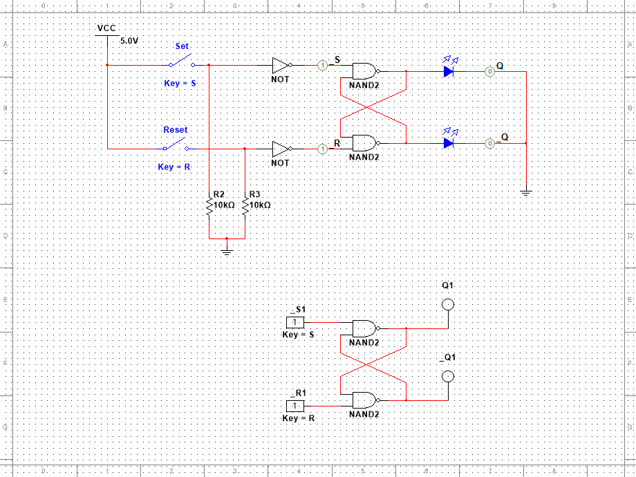
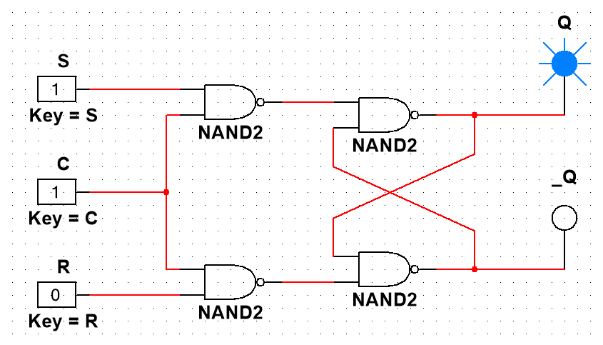
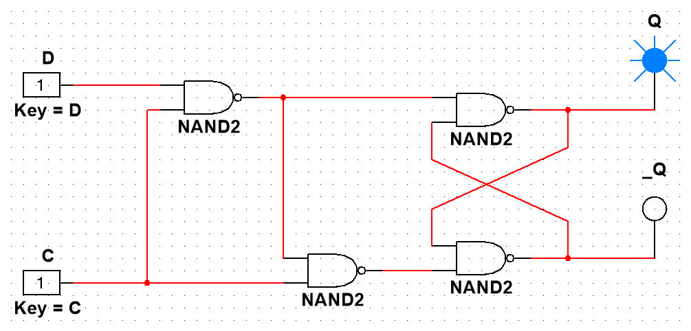
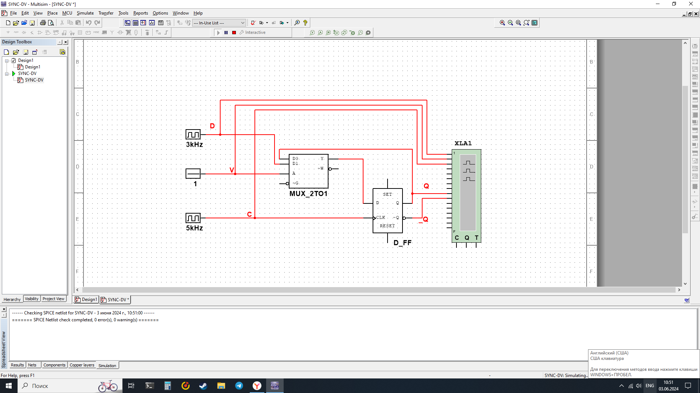
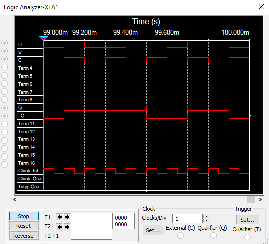
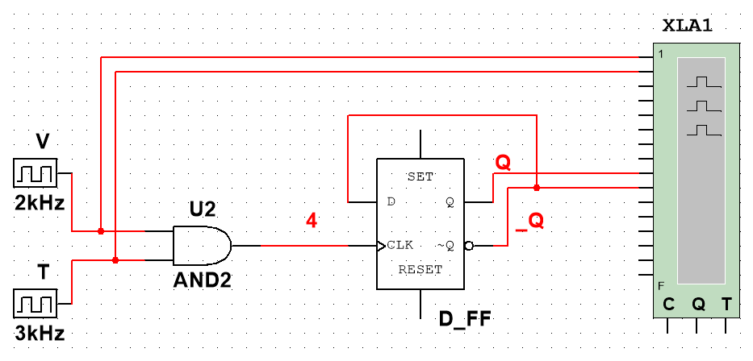
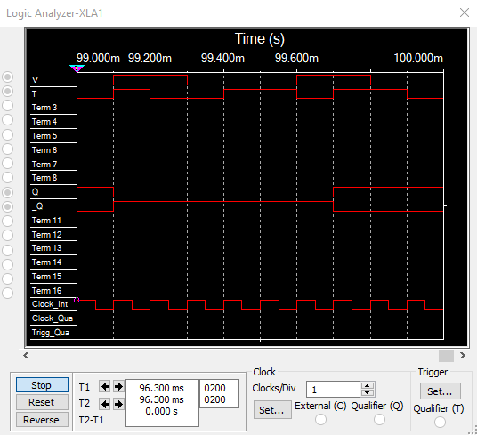

# Отчёт к лабораторной работе №1

# Синхронные одноступенчатные триггеры со статическим и динамическим управлением записью

## Содержание:

### Задания

#### Асинхронный `RS`-триггер с инверсными входами на ЛЭ `И-НЕ`

##### Схема

##### Таблица переходов

| \_S | \_R | Q[t] | Q[t + 1] | \_Q[t + 1] |
| --- | --- | ---- | -------- | ---------- |
| 0   | 0   | 0    | X        | X          |
| 0   | 0   | 1    | X        | X          |
| 0   | 1   | 0    | 1        | 0          |
| 0   | 1   | 1    | 1        | 0          |
| 1   | 0   | 0    | 0        | 1          |
| 1   | 0   | 1    | 0        | 1          |
| 1   | 1   | 0    | 0        | 1          |
| 1   | 1   | 1    | 1        | 0          |

#### Синхронный RS-триггер

##### Схема

##### Таблица переходов

| \_S | \_R | Q[t] | C   | Q[t + 1] | \_Q[t + 1] |
| --- | --- | ---- | --- | -------- | ---------- |
| \*  | \*  | 0    | 0   | 0        | 1          |
| \*  | \*  | 1    | 0   | 1        | 0          |
| 0   | 0   | 0    | 1   | X        | X          |
| 0   | 0   | 1    | 1   | X        | X          |
| 0   | 1   | 0    | 1   | 1        | 0          |
| 0   | 1   | 1    | 1   | 1        | 0          |
| 1   | 0   | 0    | 1   | 0        | 1          |
| 1   | 0   | 1    | 1   | 0        | 1          |
| 1   | 1   | 0    | 1   | 0        | 1          |
| 1   | 1   | 1    | 1   | 1        | 0          |

#### Синхронный D-триггер

##### Схема

##### Таблица переходов

| \_C | \_D | Q[t] | Q[t + 1] | \_Q[t + 1] |
| --- | --- | ---- | -------- | ---------- |
| 0   | 0   | 0    | 0        | 1          |
| 0   | 0   | 1    | 1        | 0          |
| 0   | 1   | 0    | 0        | 1          |
| 0   | 1   | 1    | 1        | 0          |
| 1   | 0   | 0    | 0        | 1          |
| 1   | 0   | 1    | 0        | 1          |
| 1   | 1   | 0    | 1        | 0          |
| 1   | 1   | 1    | 1        | 0          |

#### Синхронный D-триггер с динамическим управлением записью

##### Схема

##### Таблица переходов

| C[n] | C[n+1] | D   | Q[n] | Q[n+1] |
| ---- | ------ | --- | ---- | ------ |
| 0    | 0      | \*  | 0    | 0      |
| 0    | 0      | \*  | 1    | 1      |
| 0    | 1      | 0   | \*   | 0      |
| 0    | 1      | 1   | \*   | 1      |
| 1    | 0      | \*  | 0    | 0      |
| 1    | 0      | \*  | 1    | 1      |
| 1    | 1      | \*  | 0    | 0      |
| 1    | 1      | \*  | 1    | 1      |

#### Синхронный D-триггер с динамическим управлением записью в динамическом режиме

##### Схема

##### Временная диаграмма

##### Объяснение работы

Триггер переходит в новое состояние, переданное на вход D, только при V = 1 и изменения сигнала на входе C синхронизации с 0 на 1 (по прямому фронту), в остальных случаях DV-триггер находится в состоянии хранения.

#### DV-триггер, включенный по схеме TV-триггера

##### Схема

##### Временная диаграмма

##### Объяснение работы

Синхронный T-триггер изменяет свое состояние на противоположное сигналом C при подаче на вход T единичного сигнала.

### Контрольные вопросы

1. Триггер - запоминающий элемент с двумя устойчивыми состояними, которые кодируются цифрами 0 и 1.
2. Структурная схема триггера состоит из **схемы управления** (СУ) и **запоминающей ячейки** (ЗЯ).
3. Триггеры классифицируют по следующим основным признакам:
   - по способу организации логических связей (RS, D, T, JK, DV, и т.д.)
   - по способу записи (асинхронные, синхронные)
   - управление записью (статическое, динамическое)
   - по способу передачи информации со входов на выход (одноступенчатые, двухступенчатые)
4. Функциональное назначние входов триггера следующее:
   - S (set) - установка
   - R (reset) - сброс, очистка
   - C (clock) - синхронизация
   - D (data/delay) - данные
   - V (valve) - разрешение
   - T (toogle) - переключатель
   - J (jerk) - внезапное включение
   - K (kill) - внезапное отключение
5. **Асинхронный триггер** - это триггер, у которого переходот из одного состояния в другое происходит при изменение информацинных сигналов и не связан с тактовыми сигналами.
   **Синхронный триггер** реагирует на информационные сигналы только при наличие разрешающего сигнала на специальном управляющем входе C, называемом входом синхронизации.
6. **Таблица переходов** отображает зависимость выходных сигналов триггера в следующий момент времени от входных сигналов и состояния триггера в предыдущий момент времени.
7. Асинхронный RS-триггер:
   - устанавливается в состояние 1 при поступлении сигнала на вход S
   - устанавливается в состояние 0 при поступлении сигнала на вход R
   - сохраняет предыдущее состояния при отсутствие сигналов на свои входах
   - одновременная подача сигналов на оба входа R и S является запрещенной комбинацией
8. Синхронный RS-триггер:
   - сохраняет предыдущее состояние при отсутствие сигнала на тактовом входе C
   - работает как асинхронный RS-триггер при поступлении сигнала на тактовый вход C
