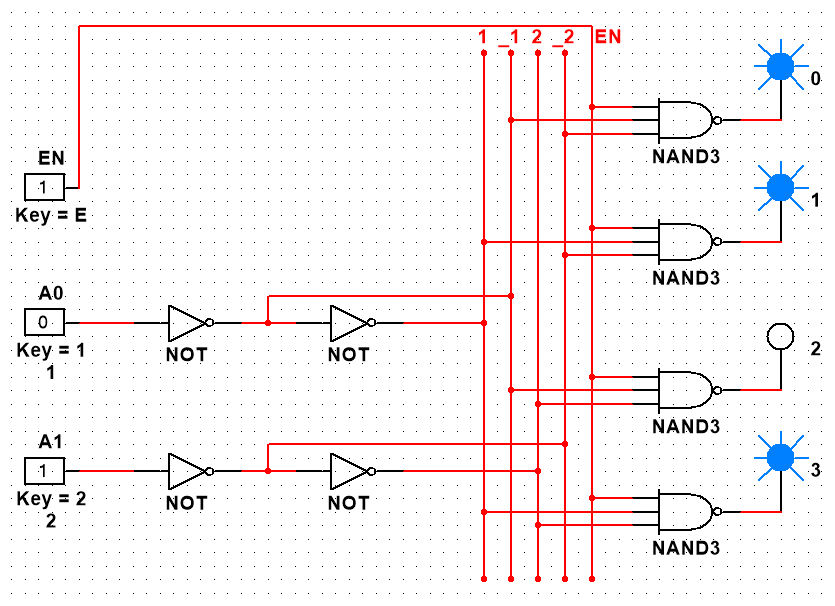
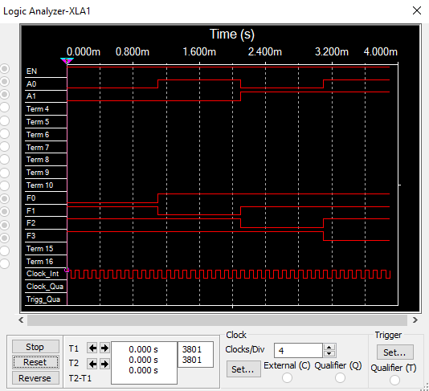
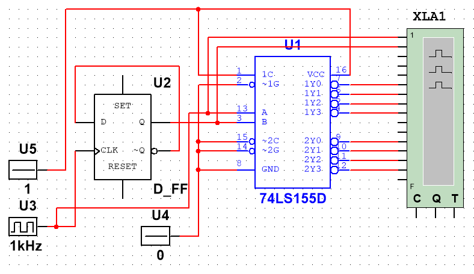
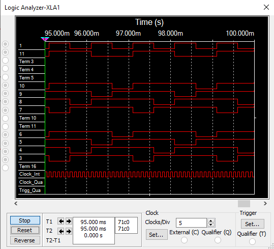
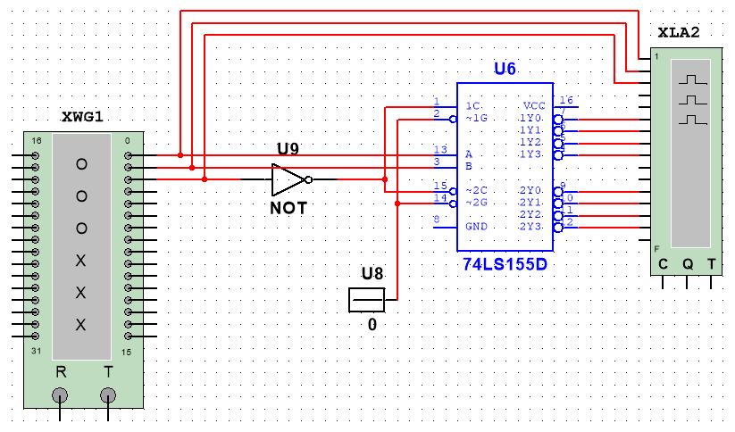
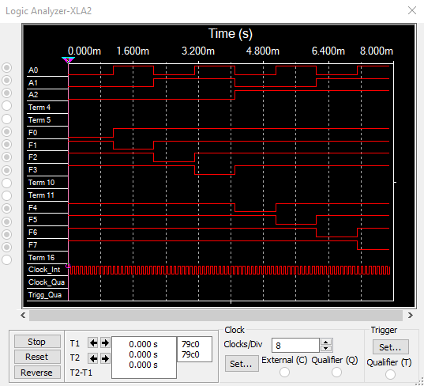
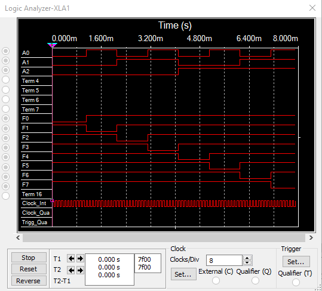
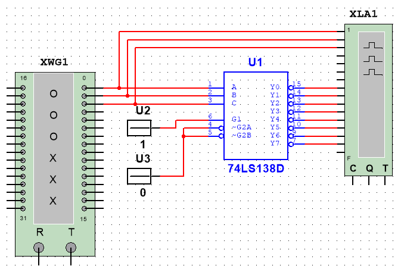

# Отчёт к лабораторной работе №2

## Задания

### Исследование линейного двухвходового дешифратора с инверсными выходами

| EN  | A1  | A0  | F0  | F1  | F2  | F3  |
| --- | --- | --- | --- | --- | --- | --- |
| 0   | \*  | \*  | 1   | 1   | 1   | 1   |
| 1   | 0   | 0   | 0   | 1   | 1   | 1   |
| 1   | 0   | 1   | 1   | 0   | 1   | 1   |
| 1   | 1   | 0   | 1   | 1   | 0   | 1   |
| 1   | 1   | 1   | 1   | 1   | 1   | 0   |

### Исследование дешифратора ИС К155ИД4 (74LS155)

#### Двухвходовый

#### Трехвходовый

| A2  | A1  | A0  | F0  | F1  | F2  | F3  | F4  | F5  | F6  | F7  |
| --- | --- | --- | --- | --- | --- | --- | --- | --- | --- | --- |
| 0   | 0   | 0   | 0   | 1   | 1   | 1   | 1   | 1   | 1   | 1   |
| 0   | 0   | 1   | 1   | 0   | 1   | 1   | 1   | 1   | 1   | 1   |
| 0   | 1   | 0   | 1   | 1   | 0   | 1   | 1   | 1   | 1   | 1   |
| 0   | 1   | 1   | 1   | 1   | 1   | 0   | 1   | 1   | 1   | 1   |
| 1   | 0   | 0   | 1   | 1   | 1   | 1   | 0   | 1   | 1   | 1   |
| 1   | 0   | 1   | 1   | 1   | 1   | 1   | 1   | 0   | 1   | 1   |
| 1   | 1   | 0   | 1   | 1   | 1   | 1   | 1   | 1   | 0   | 1   |
| 1   | 1   | 1   | 1   | 1   | 1   | 1   | 1   | 1   | 1   | 0   |

### Исследование дешифратора ИС КР531ИД14 (74LS139)

### Исследование дешифратора ИС 533ИД7 (74LS138)

### Контрольные вопросы

1. **Дешифратор** - комбинационный узел с `n` входами и `N` выходами, преобразующий каждый набор двоичных входных сигналов в активный сигнал на выходе, соответствующий этому набору.
2. Дешифратор с `n` входами, имеющий `2^n` выходов, называется **полным**, при меньшем числе выходов - **неполным**.
